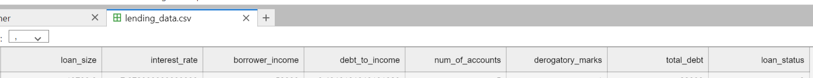

___
# Crediteval
**Crediteval** is a prediction algorithm to help manage risk in lending.
___
# Purpose
In the recent years Peer-to-peer lending have become a popular alternative source for loan seekers. In particular, common characteristics among loan seekers in peer-to-peer lending are someone who otherwise do not qualify in the conventional methods requiring stringent qualifications. Servicing loans in this type of market means higher risk for customer to default. Lenders can benefit to lower the risk by loan defaults using **Crediteval** prediction algorithm.
___
# Goals
- Classify training data set accurately.
- Predict the likely hood for loan applicants to default on their loan using trained algorithm.
___
# Usage
Inputs to the algorithm showing below image.

___
# Technology

___
# Installation
For dependencies intallation use Python's package manager for the requirements.txt file.
- Type in the command line interface: **_pip install -r requirements.txt_**
___
### Image Attribution
Title: Default on calculator\
Image by: Mike Lawrence\
Source: [Flickr](https://www.flickr.com/photos/157270154@N05/27175447577/in/photolist-HppgMB-iVwEfC-8Wg12i-7U2tND-7U2tkc-7U2skr-7U2s9H-7U5EtG-7U5ECG-7NyhKP-7U5GtU-7U5EP3-7U5DWA-7NyhBt-7RGdB4-7U2tJp-7NyitH-7Nyi4t-7U2u5K-5xVf2y-7U5EgQ-7U2tfV-7U2uq4-7RKsKy-7U2tZt-7U2riM-7Nyhx2-7RKth3-7NCh3s-7NyhYP-7U5EJJ-7U5Gd3-7Nyiqt-7U5FEh-23bfNgp-cJvf4u-aqpTTy-SR17RS-2nRmmFs-2jrVLY1-5DYsto-2nU38g1-7U2t92-7NyhsZ-cdRQiq-7RKspw-7NyhnT-8vnr9c-2nU3Zbm-2kjj7kD), [Blog](http://www.creditdebitpro.com)\
License: https://creativecommons.org/licenses/by/2.0/legalcode
